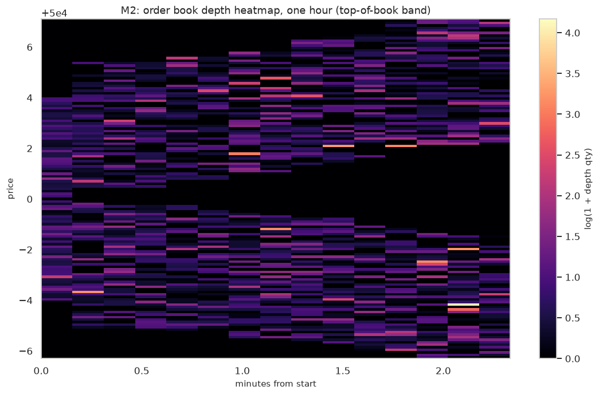
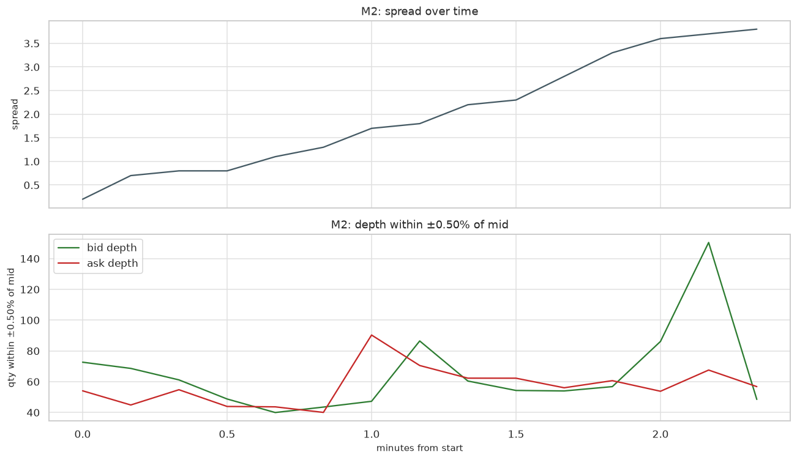
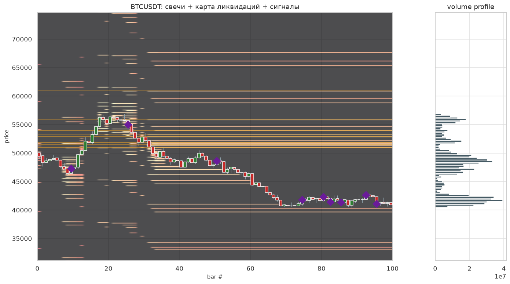
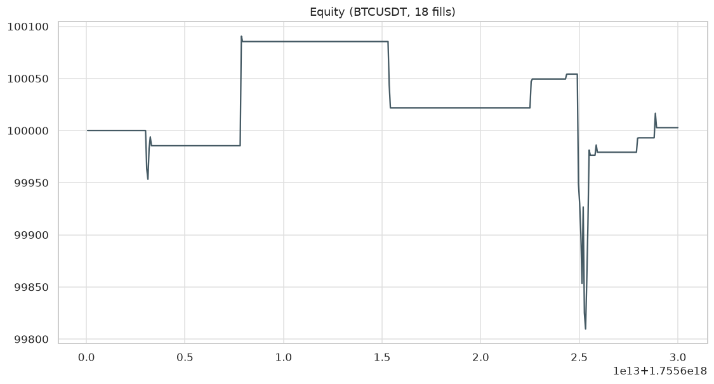
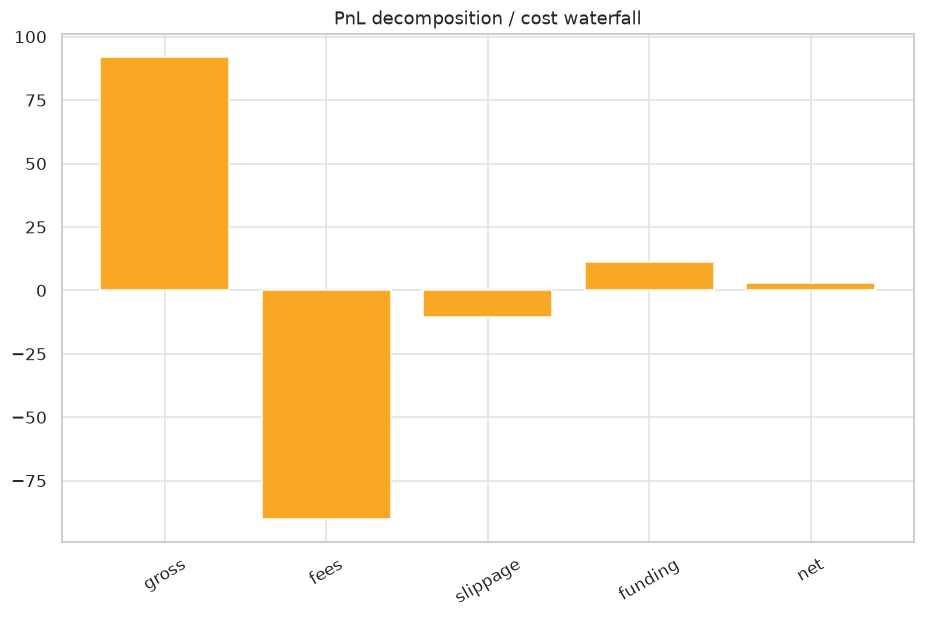
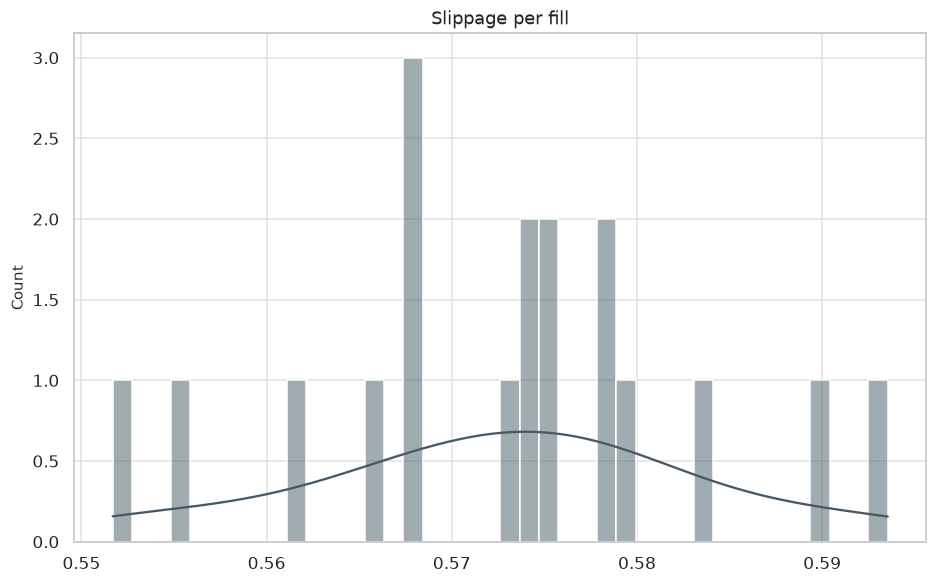

# Отчёт: pipeline

Сквозной прогон: запись → стакан → фичи → карта → профиль → сигналы → бэктест.

## Стакан: heatmap глубины

## Спред и глубина ±0.5%

## Свечи + карта + сигналы + профиль

## Бэктест: equity

## Бэктест: водопад издержек

## Проскальзывание

