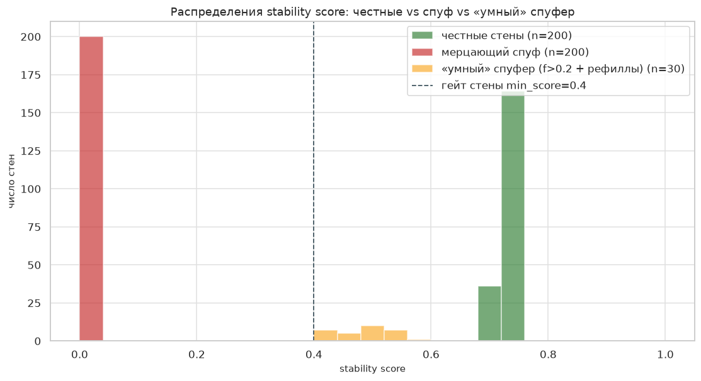
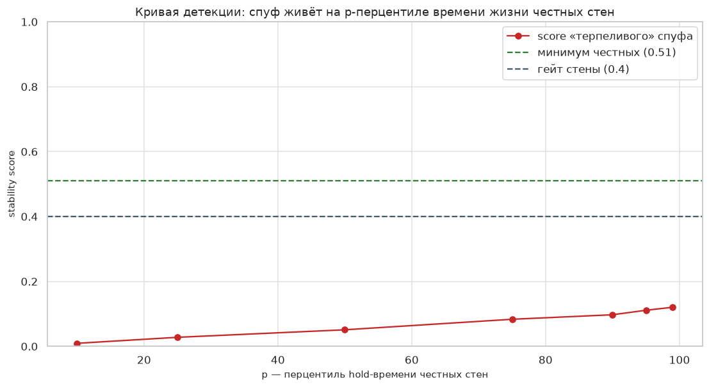
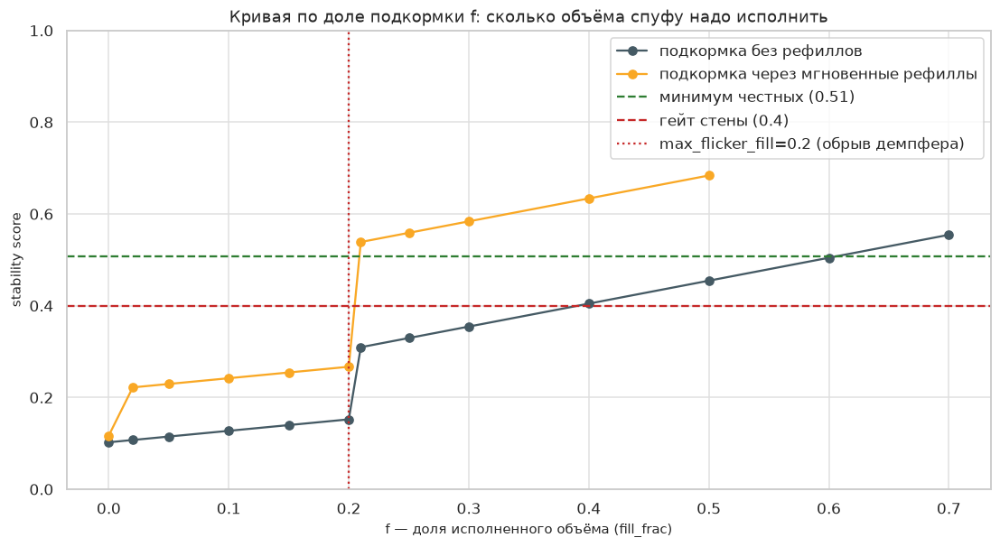

# Отчёт: stress-m6 — адверсариальная батарея спуфинг-детектора

Границы детектора M6 (lifecycle → metrics → score) числами: где он силён,
где слеп и сколько стоит его обмануть. Все сценарии сидированы
(tests/stress/test_stress_m6_spoof.py); формула: base = (0.25·pct + 0.50·fill
+ 0.25·r/(r+1)), score = base·0.5^flick. Операционный гейт «стена настоящая»
— min_score=0.4 (walls.wall_zones_at); конвенция качества — precision/recall
≥ 0.8 (test_m6_labeled_day).

## Precision / recall по сценариям (флаг flicker)

| Сценарий | precision | recall | Детали |
|---|---|---|---|
| A: 200 честных vs 200 мерцающих спуфов | 1.000 | 1.000 | tp=200 fp=0 fn=0 tn=200 |
| H: large_k=1.5 | 1.000 | 1.000 | tp=80 fp=0 fn=0 tn=80 |
| H: large_k=3.0 | 1.000 | 1.000 | tp=80 fp=0 fn=0 tn=80 |
| H: large_k=6.0 | 1.000 | 0.600 | tp=48 fp=0 fn=32 tn=80 |

Порог «крупного уровня» ×0.5 (large_k=1.5) качества не портит; ×2 (large_k=6)
выкидывает стены qty < 6·медианы из «крупных» — recall падает до
0.60 (слабость калибровки порога).

## Найденные граничные числа

| Граница | Значение | Смысл |
|---|---|---|
| n_flick* (score < 0.4) | **0** | уже ОДНО появление с отменой без принтов даёт score 0.109: отмена забирает fill-компонент (вес 0.50) и сама считается фликером (демпфер 0.5) |
| n_flick* (флаг flicker, k=3) | **2** | 3 рождения в окне 60 с; дальше score гаснет вдвое за фликер (n=8 → 0.0004) |
| p* (терпеливый спуфер) | **не существует** | стена, живущая даже на p99 честных времен, набирает лишь 0.120 ≤ w_life/2 = 0.125; минимум честных 0.509 |
| обрыв на max_flicker_fill=0.2 | score ×2.0 | f=0.20 → 0.152, f=0.21 → 0.310: жёсткая граница квалификации фликера — дешёвая точка обхода |
| f* (гейт 0.4, без рефиллов) | **0.40** | подкормка ~40% объёма проходит операционный гейт стены |
| f* (неотличим от честных, без рефиллов) | **0.70** | score ≥ минимума честных только при f ≥ 0.70 |
| минимальная стоимость маскировки | **f ≈ 0.21** (с рефиллами) | f чуть выше 0.2 + мгновенные рефиллы: score 0.539 ≥ минимума честных 0.508, плюс ярлык iceberg |
| слепота на «умных» спуферах | **100%** проходят гейт | популяция из 30 спуферов «долго стоит + кормит f∈[0.21,0.30] рефиллами» |

## Айсберг vs спуф (E): рефилл ≠ флик

| Айсберг | score | флаг iceberg | принят за мерцание? |
|---|---|---|---|
| r=1 | 0.700 | нет | нет |
| r=2 | 0.754 | да | нет |
| r=4 | 0.800 | да | нет |
| r=8 | 0.835 | да | нет |
| r=16 | 0.873 | да | нет |

Граница флага iceberg — r ≥ 2 (min_refills). «Поздний» рефилл (400 мс > окна
300 мс) цепочку не строит (chain_refills=0), но стена умирает исполненной:
score 0.512, фликером не считается. Путаницы айсберг/спуф нет.

## Ложные срабатывания на шуме (G), 100 сидированных дней на вариант

| Фон | дней с ложным flicker | ложных эпизодов | «крупных» эпизодов в шуме |
|---|---|---|---|
| без крупных уровней вообще (qty ≤ 2) | 0 | 0 | 0 |
| хвосты σ=0.5 | 0 | 0 | 253 |
| хвосты σ=0.7 | 1 | 3 | 891 |
| хвосты σ=1.0 | 6 | 18 | 1965 |

Ноль ложных срабатываний держится до σ≈0.5 включительно; с σ≈0.7 чёрн изредка
рождает «крупный» уровень, умирающий отменой ≥ 3 раз в окне, — FPR растёт с
толщиной хвостов (6% дней при σ=1.0).

## Масштаб и перф (I)

- 500 одновременных стен, 138,801 строк уровней (книжных событий),
  1600 эпизодов: полный проход детектора за **0.24 с**
  (генерация 0.03 с); все 500 стен распознаны крупными,
  минимальный score честной стены 0.509 > 0.4.
- wall_zones_at на 1000 эпизодов и merge_zones на 2000 зон — миллисекунды
  (см. test_j_thousand_zones_merge_fast_and_sorted).

## Графики

## Выводы

**Сильные стороны**
- Классика ловится идеально: на 200/200 честных vs мерцающих precision=1.00,
  recall=1.00; разрыв популяций по score огромен (мин. честных
  0.71 vs макс. спуфа 0.01).
- Терпение не спасает спуфера: без исполнений даже p99-долгожитель набирает
  ≤ 0.125 — w_life (0.25) мал, а отмена в конце забирает fill-вес и включает демпфер.
- Одна-единственная отмена крупного уровня уже роняет score ниже гейта (n_flick*=0).
- Айсберги не путаются с мерцанием ни при быстрых, ни при поздних рефиллах.
- На шуме без крупных уровней ложных срабатываний ровно ноль; перф с запасом
  (100k+ событий за доли секунды).

**Слабые стороны**
- Главная: маскировка стоит всего ~21% объёма. f чуть выше max_flicker_fill=0.2
  плюс мгновенные рефиллы — и спуф неотличим от честной стены
  (100% «умных» спуферов проходят гейт) да ещё и помечен «айсбергом».
- Жёсткий обрыв на max_flicker_fill=0.2: score прыгает ×2.0 при f 0.20→0.21 —
  адверсарию известна дешёвая точка обхода.
- w_fill=0.50 линейно оплачивает подкормку: без рефиллов гейт пробивается при f≈0.40.
- Iceberg-бонус r/(r+1) зарабатывается самоисполнением: рефилл после «своего» принта
  неотличим от честного рефилла.
- large_k×2 роняет recall до 0.60; порог кратен медиане, а не notional.
- На толстохвостом фоне (σ≥0.7) flicker даёт ложные флаги.

**Чем дожать**
- Штраф за абсолютную отменённую массу: canceled_qty у «замаскированного» спуфа
  всё равно ~79% notional — метрика cancel_to_fill на уровне цены ловит то, что
  score прощает.
- Сгладить обрыв: вместо жёсткой границы max_flicker_fill демпфировать флик
  весом (1 − fill_frac) — исчезает точка обхода f=0.2+ε.
- Iceberg-бонус выдавать только эпизодам, умершим исполненными (fill_frac ≥
  exec_min_fill), — рефиллы перед финальной отменой не должны награждаться.
- Порог «крупного» калибровать по notional/ATR, а не кратностью медианы —
  устойчивость recall к large_k×2 и к толстым хвостам фона.

## M7: стресс сигнального слоя (signals/detectors)

Границы (tests/stress/test_stress_m7_signals.py):
- **s1_magnet**: пул ровно на k·ATR — сигнал (граница включительная); heat ровно
  θ·ΣH — сигнал; edge-trigger без дублей и префиксная согласованность на
  50,000 барах; пустая карта / все пулы тронуты → 0 событий; пул,
  тронутый ровно на закрытии бара, на этом баре уже не цель. ATR=0 не
  фильтруется: пул ровно на close даёт вырожденный «магнит в себя»
  (target == price, side=−1) — задокументировано.
- **s2_sweep_reversal**: прокол ровно на уровне — НЕ прокол (строгое >);
  префиксная согласованность на 50,000 барах при return_bars=3;
  при return_bars ≥ 4 согласованность ЛОМАЕТСЯ на вложенных проколах
  (полный день отдаёт бар первому проколу, префикс — второму; другой ts и
  target) — задокументированная дизайн-слабость.
- **s3_filter**: зона с heat ровно на квантили — блокирует (≥); касание края
  пути — блокирует (включительно); зоны покрывают всё → вето 100%; зон нет /
  все вне пути → вето 0%.

Перф (сидированный день):
- s1: 50,000 баров × 7 пулов — 0.42 с (6 событий);
- s2: 50,000 баров × 2 уровня — 0.02 с (30 событий);
- шторм s1: 1000 пулов × 1,000 баров — 0.53 с;
- шторм s3: 1000 зон × 1,000 событий — 0.44 с
  (заблокировано 158).

Сложность s1/s3 — питоновские циклы O(баров×пулов) / O(событий×зон): на
штормовых размерах укладывается в доли секунды, но это первый кандидат на
векторизацию при росте карты.
